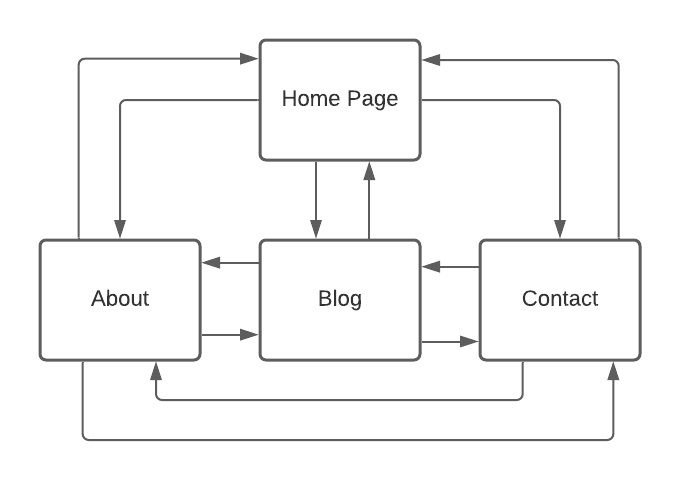

# Website Documentation

## Purpose and Target Audience:
The target audience of my website is aimed toward potential employers for frontend or backend developer jobs. The overall purpose of the website is demonstrate key information about myself to the potential employers. These key features include, a home page to demonstrate skills and my resume, an about page to give background information, blog page, and contact page for the employers to get into contact with me.  

## Links
[My Website](https://nathan-ewan.netlify.app/)

[Github Repo](https://github.com/NathanEwan02/first-website)

## Site Map

## Functionality / Features

### Home Page 1:

This first image is a screenshot of the top of the home page. All of the four pages contain the nav bar at the top of the screen with hyper links to each page, displayed as flex inside the header. Below that is the main section of the page with a h1 title of my name, paragraph to give a brief description of myself and a button that will take the user to the contact page. next this is an image of me with a coloured border for added style. When the page is reduced to 480px the photo will then disapear to make room for the text. 

### Home Page 2:

In the middles section of the home/index page there are three cards layed out into three columns in a grid. Each card gives a general overview of my current skills and experience. All three have been stylized with rounded edges and turqoise border with a box shadow. When the screen is reduced to 960 pixels, a media query will sort the grid layout to be one column so that it better fits a tablet screen. The same thing happens when the screen width goes below 480px.

### Home Page 3: 

This screenshot the bottom section of the contains an image of my resume in the center of the page. Below that there is a link to the pdf document of that same resume. As the page reduces in size to the tablet screen and mobile screen, the image takes up more space.

### Home Page 4:

The Final image above displays the footer. This footer remains consitent throughout the pages. The footer uses flex to display the three icons and uses 'justify content' to evenly space the content. Each icon is a link to a different site to get into contact with me.

### About Page 1:

On this screenshot the main about section is displayed at the top of the page with the main title and a paragraph tag to describe the purpose of the page. Below that is an image to the left side of the screen and a subtitle with a paragraph beneath it. The paragraph gives a description of my hobbies and skills. When the screen shrinks to tablet or mobile the page is displayed as one column with the image on top and the description beneath it.

### About Page 2:

This image is the bottom section of the page and similar to the one above contains, a image to the left and a description to the right of it. This description covers my background and education and will also display in one column when on tablet and mobile.

### Blog Page 1:

On the blog page the top section contains the title and description of the webpage. Below that are the third and fourth blog posts each holding a title, date and text. All of the blog posts on this page have been organised by date from most recent to least. 

### Blog Page 2:

The bottom half of the page has the last two blog posts made before the first two. Each blog post inculding the ones above have been stylized with a turquise color, a border radius and a box shadow. When the screen width goes below 960 pixels the screen dispalys on column in the grid layout and has each post descending down the page inorder.

### Contact Page:

The contact page displays the title at the top center of the screen and below that has an unordered list of links and/or ways of contacting me. The list is displayed as flexbox and is surrounded by a colored boarder. When the screen width is decrease the box containing the list shrinks and displays the list elements vertically. 

### Contact Page 2:

The lower half of the contact page is a form with an input for email and an input for text. This is still a work in progress, future iterations of the website will be coded in javascript to send messages to my email from the website.

## Tech Stack
This website is static and only uses html and css to display the pages on screen. Netlify was a website used to deploy my website on their servers so that it can be viewed by employers and users. Javasript has not been used however it will be used in future iterations.

